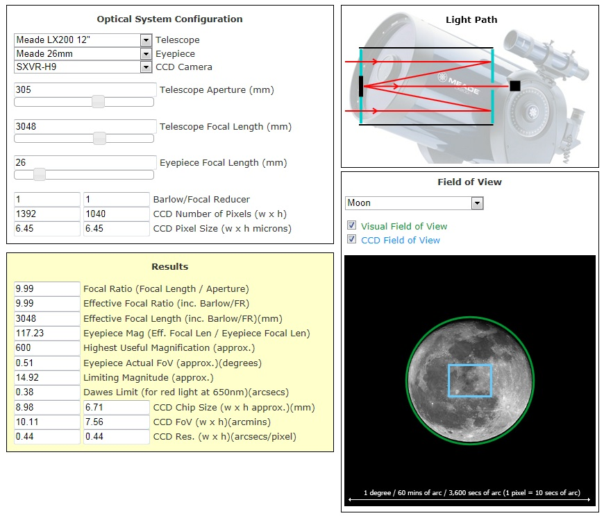

# ScopeSimulator

Telescope Simulator

 **Archived Visual Studio 2010 project that was previously held in Team Foundation Server**

The Scope Simulator is a simple simulation of an imaging system. It provides a means of visualizing the interactions between the various components in an optical/imaging system.

 
 
